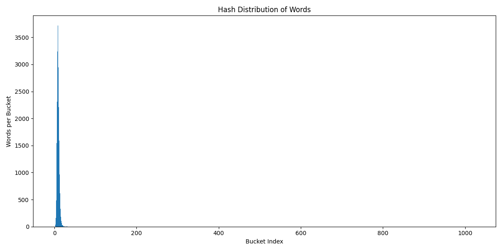
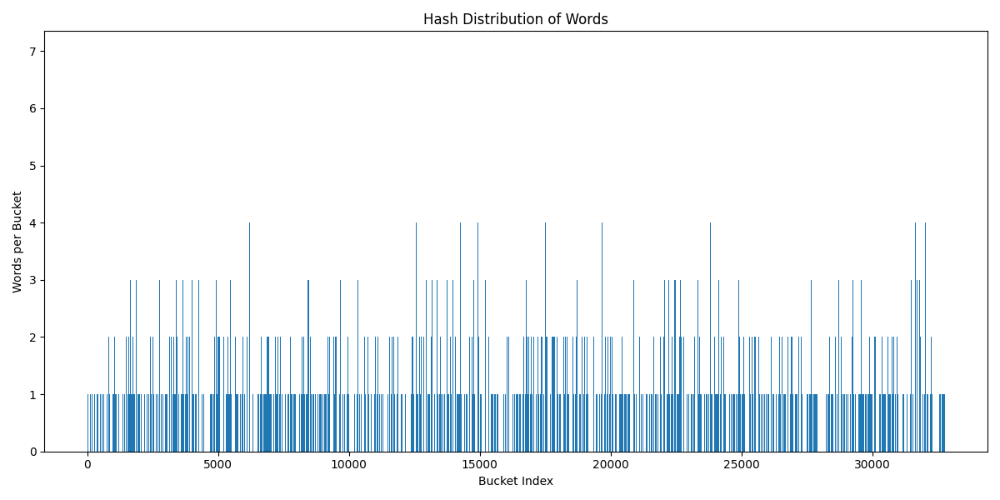
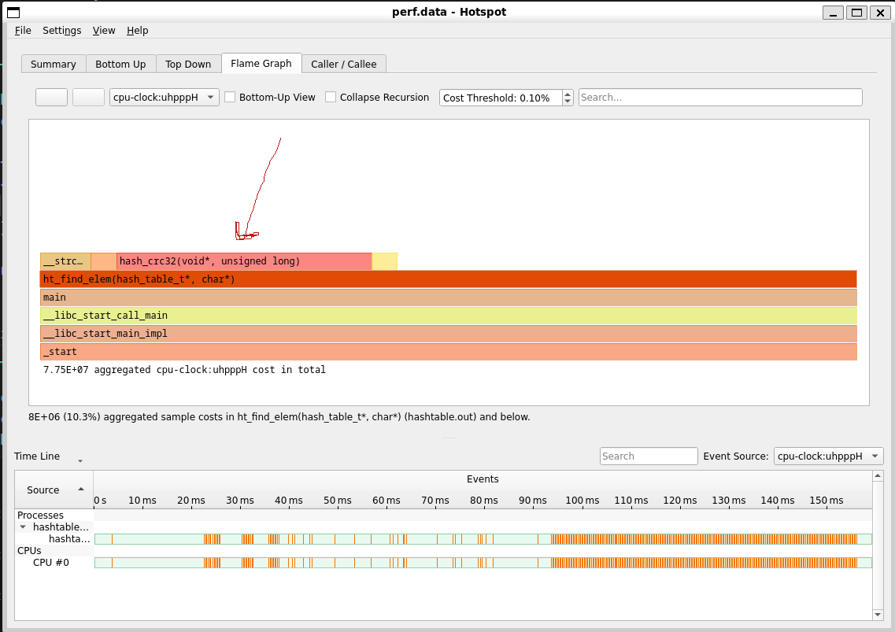

# Оптимизация Хэш-Таблицы

## Введение
Хэш-таблица - способ хранения данных с временем поиска элемента `O(1)` за счёт использования хэш-функций.
Данные хранятся в бакетах (buckets), каждый из которых представляет из себя список. Количество бакетов это размер хэш-таблицы. Число элементов / размер хэш таблицы = Load-factor. Оптимальный load-factor находится между 1 и 2, но в данной работе он был искусственно повышен до 15, чтобы увеличить время поиска элемента.

Для поиска считается хэш входных данных, берётся остаток от деления на размер таблицы и получается номер бакета, в котором содержится наш элемент. Поскольку могут происходить коллизии, или же размер таблицы достаточно маленький, то в одном бакете будет содержаться несколько элементов. Но их количество гораздо меньше в сравнении со всем объёмом данных, так что дальше делается обычный линейный поиск.

В данной работе для заполнения таблицы использовался текст Л.Н.Толстого ["Война и мир"](txt_parser/war_and_peace.txt) на английском языке (около 600к слов), предварительно обработанный [python-скриптом](txt_parser/parser.py) для разделения файла на строки и удаления большинства ненужных символов

## Цели и задачи
### Цель
Оптимизация поиска в хэш-таблице различными методами
### Задачи
- Исследовать различные хэш-функции на максимально количество коллизий
- Написать базовую версию хэш-таблицы
- Подготовить текст для заполнения
- Найти узкие места в программе (функции поиска) и оптимизировать из используя как минимум три метода:
    * Ассемблерная вставка
    * Использование интринсиков
    * Использование функции, написанной в отдельном ассемблерном файле

## Исследование хэш-функций

Для максимальной эффективности работы хэш-таблицы требуется хэш функция, с наименьшим числом коллизий, то есть распределяющая все данные равномерно. Для этого рассмотрим распределения слов по таблице в зависимости от хэш-функции

### Нулевой хэш

Несмотря на запрет семинариста по матанализу говорить слово очевидно... Тут и так всё ясно - хэш таблица превратилась в обычный линейный список и никакого ускорения тут не получается

Максимальная коллизия `24330`

### Длина слова
Казалось бы, должно быть более равномерно, но всё равно в силу статистики русского языка часто встречаются слова 5-6 букв, а количство слов другой длины претерпевает резкое падение.



Максимальная коллизия `3716`

### Сумма ASCII-кодов
Тут уже не столь тривиально, ведь ascii помимо длины слова каждая буква имеет вес. Поэтому распределение получилось более равномерным, однако всё равно талица заполнена не полностью и количество коллизиий весьма высоко


Максимальная коллизия `105`

### CRC32
Математически обоснованный равномерный хэш. Достаточно прост в реализации, даёт равномерное распределние по всей длине таблицы. Всё чики-бамбони.


Максимальная коллизия `7`

### SHA256
Сложно было ожидать другого результата от алгоритма, на котором держится вся современная передача данных


Максимальная коллизия `6`

В силу нетривиальности реализации данного алгоритма, остановимся на crc32.

## Поиск оптимизаций
Сначала заполняется вся хэш-таблица, при этом каждому слову ставится в соответствие число, которое показывает, сколько раз это слово встретилось в тексте.

Затем идёт поиск - то что и замеряется в данном проекте. Вызывается фнукция поиска на 100к слов, берётся каждое четвертое слово.

Измерение времени аналогично предыдущему [проекту](github.com/AndreyBritvin/Mandelbrot)

### -O0
Для начала запустим базовую версию с -O0, как версию, которая компилируется по умолчанию, и замерим время одной инструкции

| Среднее кол-во тактов на одно слово | Погрешность, такты |
|-------------------------------------|-------------------|
| 535                                 | +-12              |

### -O3
Далее включим максимальную оптимизацию и посмотрим, насколько компилятор сможет ускорить поиск

| Среднее кол-во тактов на одно слово | Пошреность, такты | Ускорение отн. предыдущего |
|-------------------------------------|-------------------|----------------------------|
| 190                                 | +-10              | 180%                       |

### Изменение хэш-функции (интринсик)
Найдя самую горячую функции становится очевидно, что надо делать!


Надо всего лишь переписать crc32 с использованием интринсика _mm_crc32_u8

Результат:

| Среднее кол-во тактов на одно слово | Пошреность, такты | Ускорение отн. предыдущего |
|-------------------------------------|-------------------|----------------------------|
| 105                                 | +-7               | 80%                        |

### Интринсики: strcmp


```
134:    while (NEXT[previous_next] != NEXT[0])
        {
137:        if (!strcmp(text, DATA[previous_next].word))
            {
                return &DATA[previous_next];
            }

            previous_next = NEXT[previous_next];
        }
```
Зная, что в тексте не встречаются слова длиной больше 32 букв (проверено при помощи [скрипта](txt_parser/find_max_len.py)), можно оптмиизировать strcmp, который вызывается внутри поиска по списку. Оптимизация заключается в использовании `YMM` регистров и последующем сравнении двух строк при помощи интринсиков на сравнение двух AVX-регистров.

Вот получившаяся функция:

~~~
int my_avx_strcmp(const char* str1, const char* str2)
{
    __m256i string_1 = _mm256_loadu_si256((__m256i *) str1);
    __m256i string_2 = _mm256_loadu_si256((__m256i *) str2);
    __m256i equal    = _mm256_cmpeq_epi64(string_1, string_2);
    int result = _mm256_movemask_epi8(equal);

    return ~result;
}
~~~

Но данный метод оптимизации накладывает следущие ограничения:
- Поддерживаемые слова меньше 32 символов
- В исходном представлении в памяти на каждое слово также должно отводиться по 32 байта, чтобы могло быстро выполниться __m256_loadu, следовательно, перерасход памяти.

| Среднее кол-во тактов на одно слово | Пошреность, такты | Ускорение отн. предыдущего |
|-------------------------------------|-------------------|----------------------------|
| 101                                 | +-8               | 4%                         |

### Остаток от деления - ассемблерная вставка
Графики perf и hotspot больше не показывают на новые медленные места - всё что можно, уже оптимизировано. Однако по заданию надо сделать ещё два вида оптимизаций.


Поэтому я выбрал строчку для ассемблерной вставки с остатком от деления по модулю, чтобы взять частный случай размера таблицы `2^N`, таким образом заменив `div` на `&`. Получилась такая вставка:
```
asm volatile(
    "and %2, %1\n"              // instruction
    : "=r" (bucket_num)         // output
    : "r"  ((size_t) hash),     // input
      "r"  (ht->size - 1)
    );
```

Поскольку теперь размер хэш таблицы должен быть степенью двойки, то придётся его поменять на 2^15, как наиболее близкое число, которое оставляет load-factor на высоком уровнем (около 15)

Предварительно измерив тесты без ассемблерной вставки с изменненым размером таблицы, ожидаемо, не повлияло на среднее время поиска слова в таблице.

Затем измерив время с вставкой получим результат в таблице. Perf вообще перестал показывать данную строку.


Ограничения:
* Размер таблицы должен быть 2^n

| Среднее кол-во тактов на одно слово | Пошреность, такты | Ускорение отн. предыдущего |
|-------------------------------------|-------------------|----------------------------|
| 96                                  | +-5               | 5%                         |


## В завершение
Результаты всех тестов можно найти в [файле](Results.xlsx)

Итоговая таблица:
To be continued
